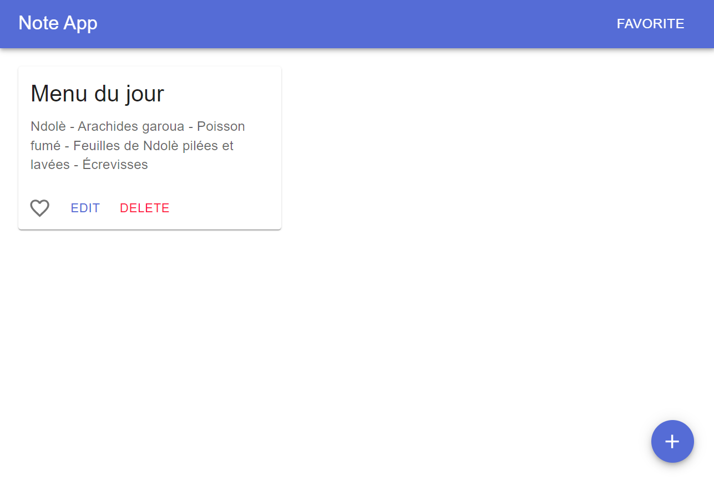

# Note-App : Un Voyage d'Apprentissage avec ReactJS

Bienvenue sur le projet "note-app", une exploration ludique et éducative dans l'univers de ReactJS. Ce projet a été conçu comme un terrain de jeu pour maîtriser les fondamentaux de React, en intégrant la bibliothèque Material UI pour une touche d'élégance et de fonctionnalité.

Note-App est une application web minimaliste conçue pour offrir une expérience utilisateur intuitive pour la prise de notes. Ce projet est inspiré par le défi "50 DAYS 50 PROJECTS", visant à construire une série de projets pour améliorer les compétences en développement web.

## Aperçu Visuel

Voici un aperçu visuel de l'application note-app: simple, intuitive, ux/ui agréable et efficace.

## Fonctionnalités et Technologies

**Fonctionnalités Clés :**
- Création, édition et suppression de notes.
- Interface utilisateur responsive et attrayante.

**Technologies Utilisées :**
- **ReactJS** : Pour une gestion efficace de l'état et une réactivité optimale.
- **Material UI** : Pour un design moderne et une expérience utilisateur cohérente.

## Démo en Ligne

Pour voir l'application en action, visitez [yoan-theophile.github.io/note-app](https://yoan-theophile.github.io/note-app/).

## Getting Started with Create React App

Ce projet a été initialisé avec [Create React App](https://github.com/facebook/create-react-app). Voici quelques commandes utiles pour démarrer :

### `npm start`

Exécute l'application en mode développement.\
Ouvrez [http://localhost:3000](http://localhost:3000) pour la visualiser dans le navigateur.

La page se rechargera si vous apportez des modifications.\
Vous verrez également les erreurs de lint dans la console.

### `npm test`

Lance le test runner en mode interactif.\

Pour plus d'informations, consultez la section sur [l'exécution de tests](https://facebook.github.io/create-react-app/docs/running-tests).

### `npm run build`

Construit l'application pour la production dans le dossier `build`.\

Pour plus d'informations, consultez la section sur [le déploiement](https://facebook.github.io/create-react-app/docs/deployment).

## Comment Contribuer

Votre contribution rendra ce projet encore meilleur ! Que vous souhaitiez corriger un bug, proposer une nouvelle fonctionnalité ou améliorer la documentation, votre aide est la bienvenue.

Pour contribuer, veuillez simplement fork le projet et créer une pull request avec vos modifications.

## Contact

Si vous avez des questions ou des suggestions concernant ce projet, n'hésitez pas à me contacter via tagnepierre9@gmail.com.

